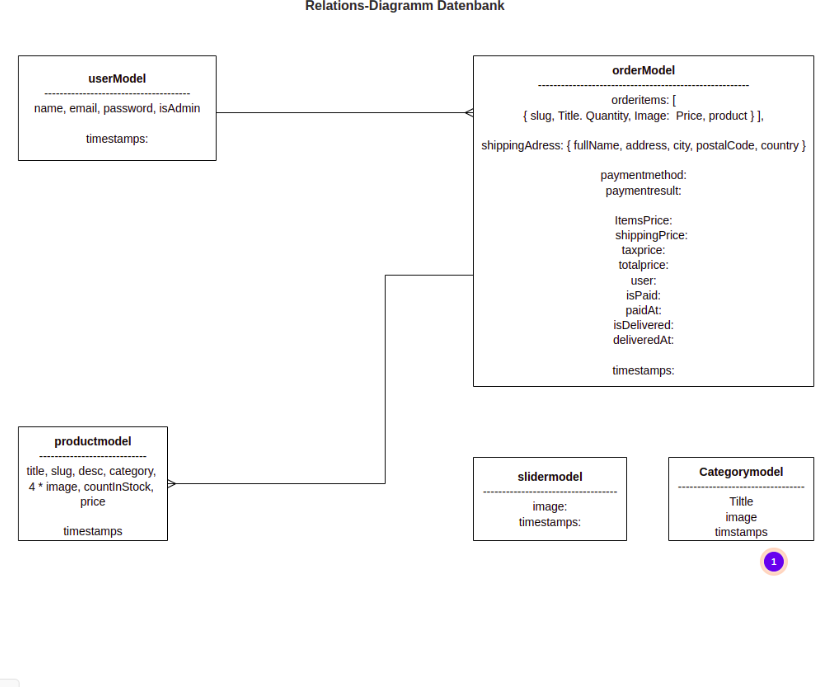

# Final Project
# DigitalLibrary
 

## Project und Name festlegen
unser-Team

## GitHub
-Administrator wählen und Project auf GitHub erstellen
-Team-Mitglieder einladen und hinzufügen

## Moqup erstellen

### Features definieren
-**Startseite**: Mit Übersicht aller Bücher
-**Navigation-Header**: Filter-search. User kann nach Bücher suchen im Suchfeld (Funktion) und danach Login (um zu kaufen)
- **Register** : Wenn der User nicht registriert ist, dann kann er einen Acount erstellen und sich automatisch melden
- **Login**: User kann sich über ein anmelde Formular in seinen Account einloggen
- **Logout**: User kann sich ausloggen 

 ## Optional Features
-**get user**: User kann seinen Acount sehen, Favoriten-Bücher, etc.

## Models
-**Relationen**: Relations-diagramm-image

## Routs - Endpunkte und Relationen definieren
-**post-login**: Daten auf die Datenbank speichern
-**post-lockout** 
-**post-register**: Daten auf die Datenbank speichern
-**get auf books**
-**get books/:id**
-**post books**: optional

 ## React Project im visual studio starten
 - npx create-react-app name des projects
